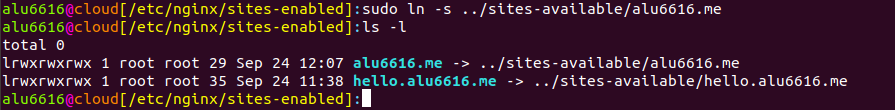

# Servidor Nginx
## Instalación del servidor

Al empezar, actualizamos la lista de paquetes usando el comando *sudo apt update*, a continuación, instalamos el **Nginx**.

Comprobamos que el servicio del servidor está **activo**.

Ahora si buscamos en un explorador la Ip de nuestra máquina o el dominio que le hemos asignado a la Ip, debería verse una pantalla con un mensaje de Nginx.

**Deshabilitamos el virtual host por defecto**

Lo hacemos para no tener ocnflictos con las configuraciones que hagamos. Nos dirigimos al directorio */etc/nginx/sites-enabled/* usando el comando **cd** y ejecutamos el comando *sudo rm default*.

Hacemos un fichero de configuración que tratará las peticiones al nombre del dominio que hemos asiganado.

Y escribimos lo siguiente:

~~~
server {
  server_name hello.alu6616.me;
  root /home/alu6616/webapps/hello/;
}
~~~

Ahora tendremos que enlazar el fichero:

Y ahora recargamos la configuracion de Nginx para que se guarden los cambios.

## Creación del subdirectorio /series

Para crearlo tendremos que hacer lo siguiente: *sudo vi /etc/nginx/sites-available/vps.claseando.es*

Y debemos escribir esto:

Habilitamos el fichero creado. Para ello nos dirigimos al directorio */etc/nginx/sites-enabled/* y ejecutamos el siguiente comando:

Volvemos a hacer *sudo systemctl reload nginx*.

Ya podemos crear el subdirectorio con su **index.html**.

# Listado de series

Ya hemos creado el subdirectorio **/series**, así que usando el comando *nano* editamos el **index**. Pero antes descargamos las imágenes que queramos poner en la lista. También podremos cambiar el tamaño de las imágenes desde el index en caso de que queramos hacerlo.

El resultado final debería acabar así:

