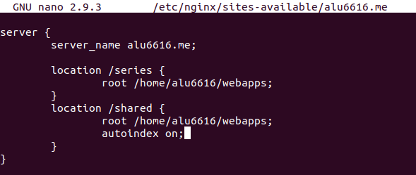
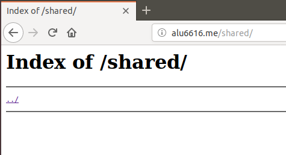
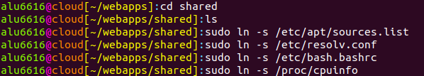
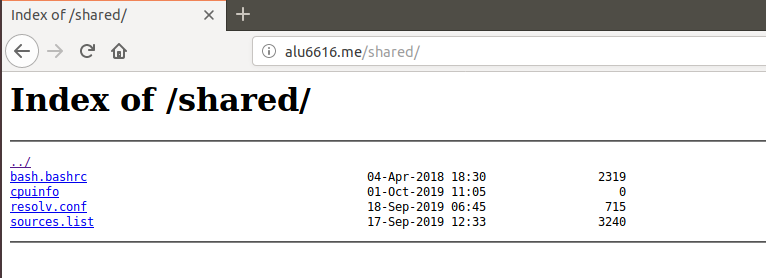

# UT1 -A2: Listado de directorios

En esta actividad vamos a permitir el acceso al contenido de un subdirectorio en la ruta raíz de *Nginx*, enlazando varios ficheros desde ahí.

>Para esta actividad, se reutilizará la máquina del ejercicio anterior.

## Creación del subdirectorio y de los ficheros

Editaremos el fichero **/etc/nginx/sites-available/alu6616.me** para añadir el subdirectorio, asignarle una ruta, y el formato *index* necesario para el listado de ficheros.

A continuación, tendremos que recargar el *Nginx* para que los cambior surtan efecto usando el comando *sudo systemctl reload nginx*.

>Deberiamos tener algo así:

>

Creamos la carpeta *shared* dentro de la carpeta *webapps*, entramos en ella y creamos los siguientes ficheros con el comando *ln -s* como se verá a continuación:

Y ahora refrescamos la página **alu6616.me/shared**.

## Resultado final

Tras refrescar la página, debería darnos el siguiente resultado:

