# **UT1-A3: Trabajo con virtual hosts**

En esta actividad, vamos a configurar 4 sitios web (virtual hosts) en nuestro servidor web *nginx*.

## Sitio web 1

Para este sitio web, asignaremos la siguiente dirección: *"http://imw.aluXXXX.me"*.
Dicha dirección nos deberá enseñar una página con la imagen "Diagrama de unidades de trabajo de IMW", la cual habremos descargado como se enseñará a continuación.


Crearemos un directorio *imw* dentro de la carpeta **webapps** y guardamos ahí la imagen.

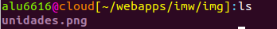

Luego creamos el servidor editando el fichero */etc/nginx/sites-available/imw.aluXXXX.me* usando el comando **nano**.

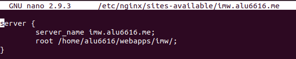

Creamos un index.html dentro de la carpeta */webapps/imw/* en el que pondremos la imagen para que se muestre correctamente.

Ahora dentro de esta carpeta deberían estar la carpeta **img** y el **index.html**.

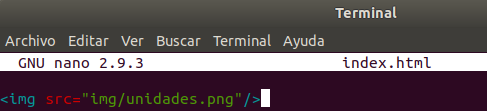

A continuación tenemos que enlazar el fichero que hemos creado para que esté disponible desde los **sites-enabled**.

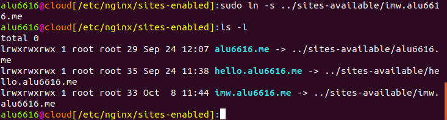

Ahora, para comprobar que hemos realizado este apartado correctamnete, no tenemos que hacer más que abrir el navegador y buscar la URL "**imw.aluXXXX.me**". Si se ve el diagrama, hemos realizado este ejercicio con éxito.

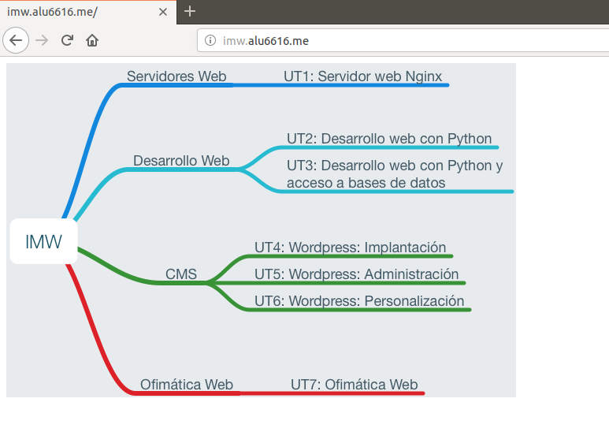

>En caso de que no aparezca, ejecutar el comando "*sudo systemctl reload nginx*"

A continuación, vamos a hacer la segunda parte de este apartado, la cual consiste en mostrar una página con un enlace al Real decreto del título de Administración de Sistemas Informáticos en Red - MEC.

Primero nos dirigimos a la carpeta **webapps** y creamos la carpeta **mec**.


Tras haberla creado, modificamos el archivo */etc/nginx/sites-available/imw.aluXXXX.me* para añadir la segunda parte de la dirección.

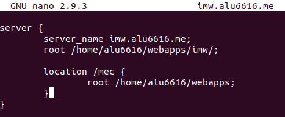

En la carpeta **mec** que creamos anteriormente, escribimos un fichero *index.html* usando el comando *nano* para añadir el enlace que nos lleve al archivo que pide el ejercicio.

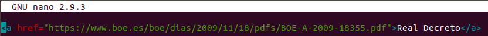

Ejecutamos el siguiente comando para reiniciar el servicio Nginx y se guarden los cambios.

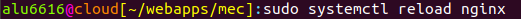

Para comprobar que hemos finalizado este primer ejercicio, nos vamos a dirigir a la página *imw.aluXXXX.me/mec* haremos click sobre el único enlace que nos debe aparecer, y por último veremos el archivo del Real Decreto.

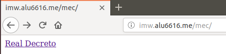

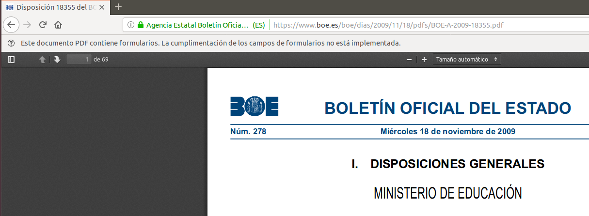

## Sitio web 2

En este segundo ejercicio debemos Debe mostrar el listado de ficheros y directorios de /var/lib de nuestra máquina.

Primero crearemos el fichero */etc/nginx/sites-available/varlib.alu6616.me* y escribimos lo siguiente:

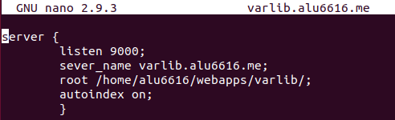

>La línea "listen 9000;" es para que la página se pueda ver desde ese puerto.

Ahora crearemos la carpeta **varlib** en la carpeta **webapps**.

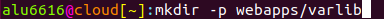

Enlazamos el fichero que creamos en el paso anterior desde */etc/nginx/sites-enabled*

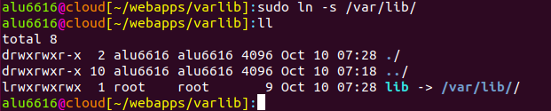

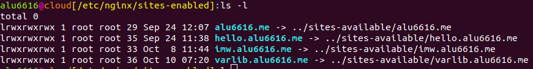

Volvemos a recargar el servicio nginx para que se guarden los cabios con el comando "*sudo systemctl reload nginx*"

Comprobamos que la página *warlib.alu6616.me:9000* enseña un index con un único enlace y que dentro de ese enlace, se pueden ver todos los ficheros de la carpeta.

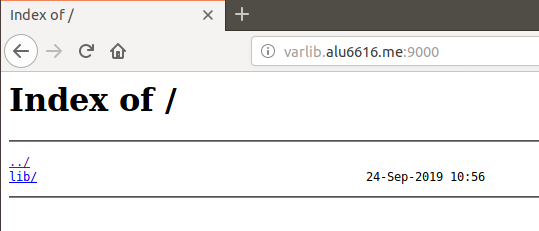

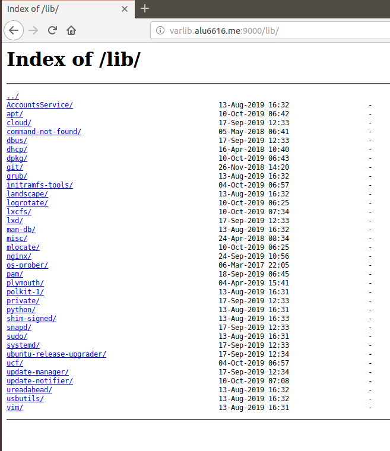

## Sitio web 3

En este ejercicio debemos mostrar una página web con el nombre de todo el alumnado de clase a través de la página *https://ssl.aluXXXX.me/students/* que crearemos a continuación.

Antes que nada, tenemos que crear el fichero que dará lugar al servidor en la carpeta */etc/nginx/sites-available/* al que llamaremos *ssl.aluXXXX.me*.

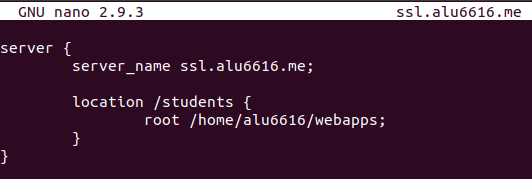

Creamos la carpeta **/webapps/students** y dentro de ella el **index.html** en el que pondremos la lista de todos los alumnos.

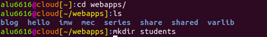

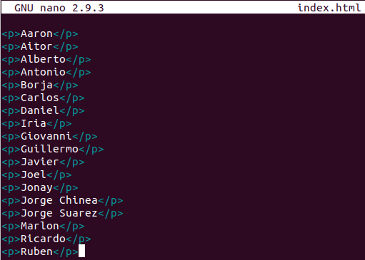

Ahora vamos anlazar en la carpeta */etc/nginx/sites-enabled* como en los apartados anteriores.


Recargamos otra vez el servicio **nginx** si queremos comprobar que vamos bien encaminados.

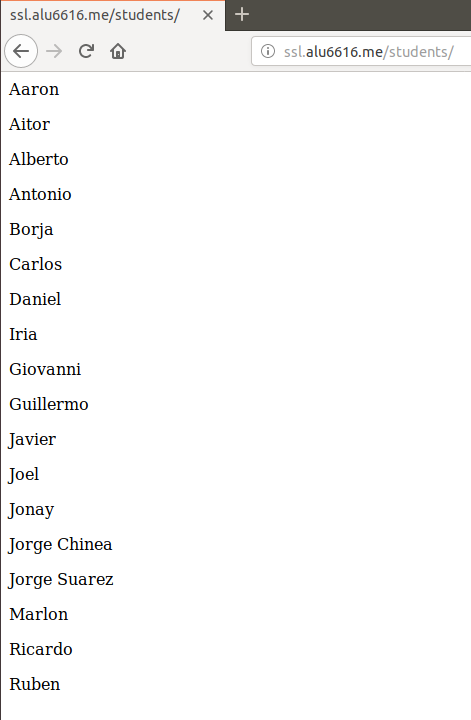

A continuación, con estos dos comandos, crearemos una contraseña encriptada eligiendo una contraseña, en este caso "**2asir**" y una palabra clave par la encriptación "**anacardo**". Luego ejecutaremos el segundo comando con un usuario a nuestra elección (**usuario1**) y poniendo la contraseña encriptada que nos ha dado el primer comando.

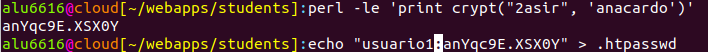

Tras haber hecho esto, para conseguir que la página nos pida el usuario y la contraseña, modificaremos el fichero */etc/nginx/sites-available/ssl.aluXXXX.me* añadiendo las siguientes líneas:

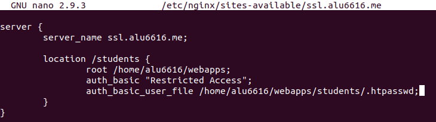

A modo de comprobación buscaremos en el navegador la página **ssl.aluXXXX.me** y veremos que nos pide identificación.

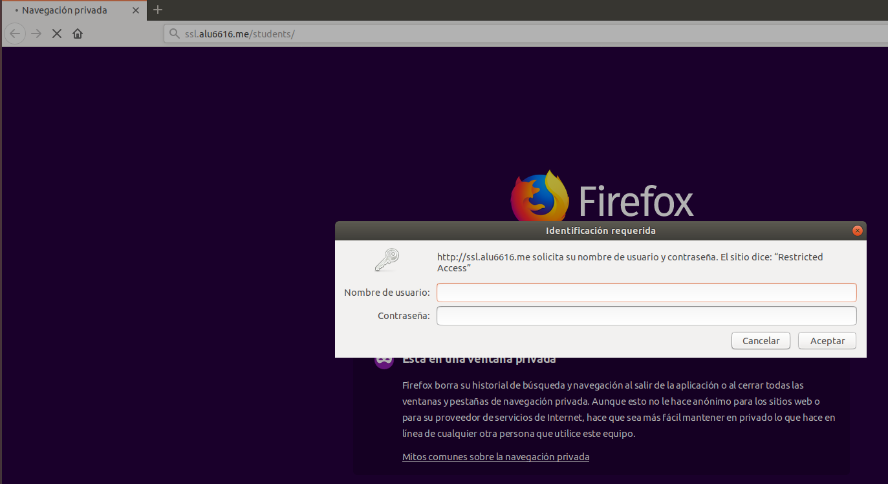

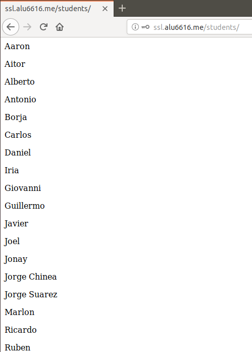

Ahora vamos a restringir el acceso al archivo **.htpasswd**, que es donde se guardan las contraseñas.

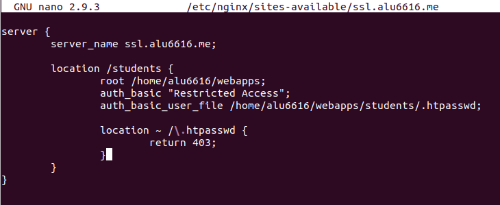

Recargamos una vez más el servicio **nginx** para que los cambios se guarden y vemos que al dirigirnos a *ssl.aluXXXX.me/students/.htpasswd* nos manda a una página con un error, eso significa que hemos restringido el acceso a ese archivo correctamente.

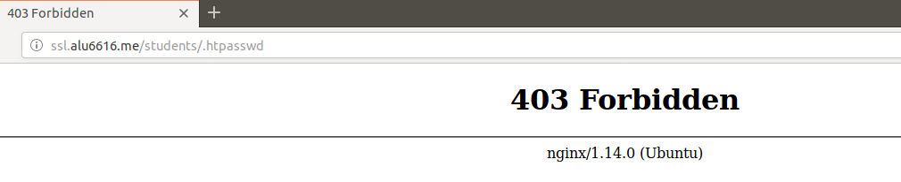

Para conseguir que ésta sea una página segura con certificado, tenemos que instalar la aplicación **certbot**, la cual se encargará de modificar los archivos necesarios para cumplir el objetivo según la configuración que hagamos.

Para ello, ejecutamos los siguientes comandos:

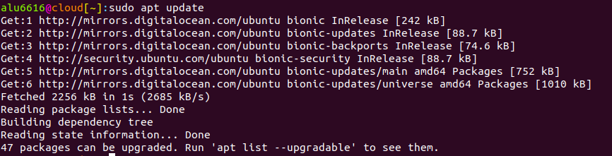

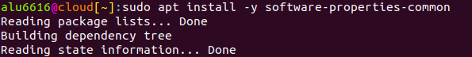

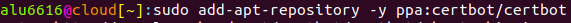

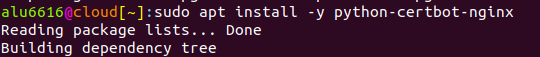

Ahora lo ejecutamos con el siguiente comando, y para configurarlo, respondemos lo que nos va preguntando a gusto de cada uno:

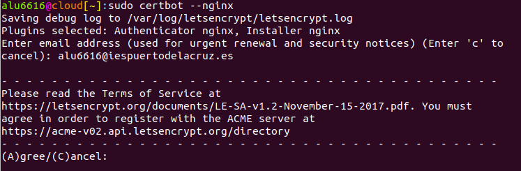

>**OJO**, a esta pregunta responder a la dirección que pide el ejercicio.

>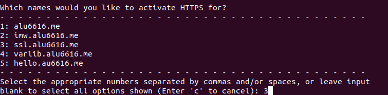

Al entrar en el fichero */etc/nginx/sites-available/ssl.aluXXXX/students* vemos que la aplicación a añadido líneas automáticamente.

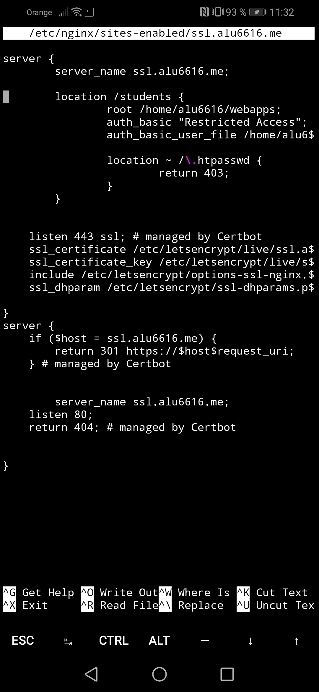

Procedemos a volver a recargar el servicio **nginx**.

Al comprobar entrando a la URL que configuramos, vemos que al lado de ella aparece un candado, lo que significa que es un sitio web seguro.

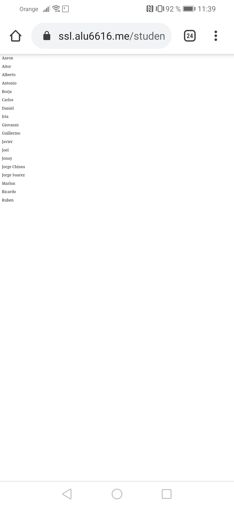

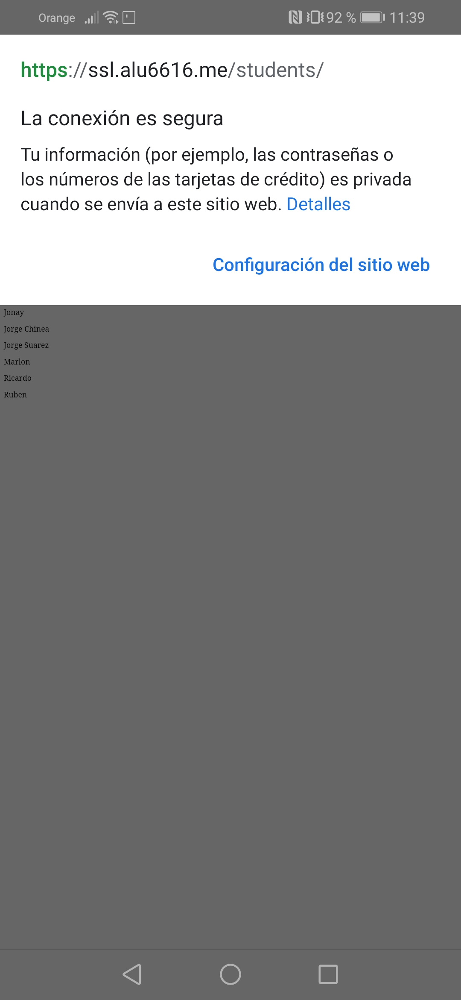

## Sitio web 4

Lo que nos pide este último ejrcicio es la  redirección cualquier petición del dominio http://redirect.aluXXXX.me al dominio http://target.aluXXXX.me.

Como en los otros tres ejercicios, debemos empezar creando el fichero */etc/nginx/sites-available/redirect.aluXXXX.me*.

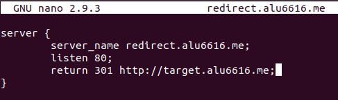

Dentro de la carpeta **webapps** descargamos el siguiente **.zip** usando el comando *wget*.

```
https://github.com/sdelquin/claseando/raw/master/imw/UT1/assignments/assignment3/initializr-verekia-4.0.zip
```

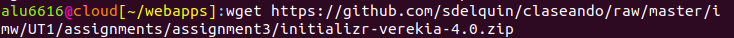

Descomprimimos lo que hemos descargado usando el comando **unzip**.

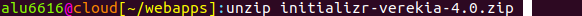

Y seguimos los siguientes pasos para borrar lo descargado y quedarnos con el fichero descomprimido y transformarlo en la carpeta **target**.

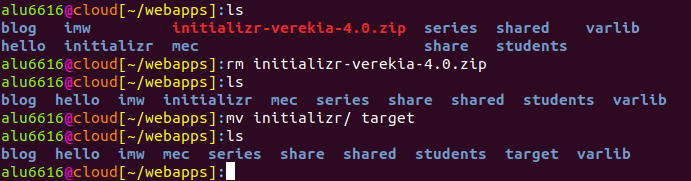

Ahora crearemos el fichero */etc/nginx/sites-available/target.aluXXXX.me*.

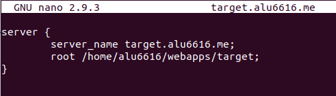

Y enlazamos las dos direcciones desde */etc/nginx/sites-enabled*.

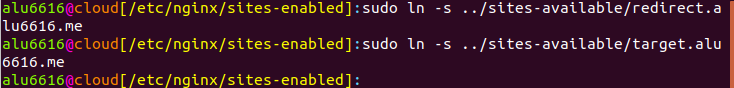

Si queremos comprobar, abrimos un navegador y buscamos *redirect.aluXXXX.me/test*, *redirect.aluXXXX.me/probando*, *redirect.aluXXXX.me/hola* o *redirect.aluXXXX.me/cualquiercosa*.

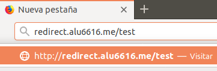

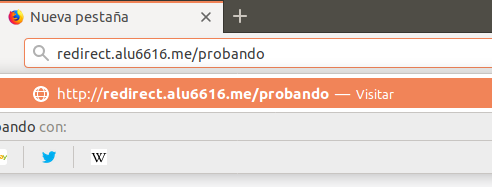

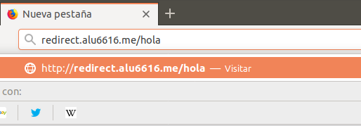

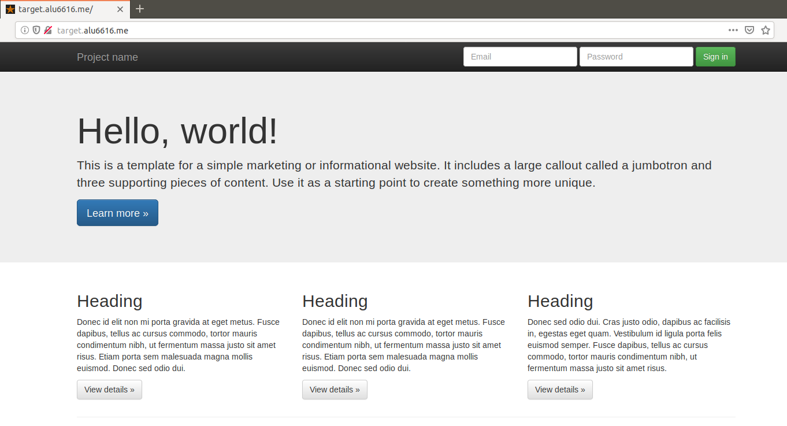

Vemos que nos ha redirigido a *target.aluXXXX.me*.

Ahora vamos a ir al directorio */var/log/nginx*

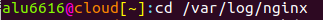

Y dentro crearemos la carpeta **redirect**.

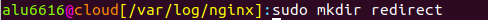

Y creamos el archivo *redirect.aluXXXX.me*. (**OJO**, si no usamos **sudo** el sistema no nos dejará)


En dicho fichero escribiremos lo siguiente:

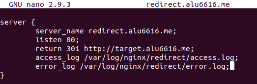

Comprobamos que en la carpeta **redirect** se han creado los archivos **access.log** y **error.log**.

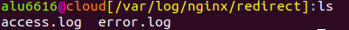

Ahora cada vez que se entre a la página, quedará registrado, como se ve en la siguiente imagen:

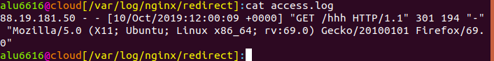
