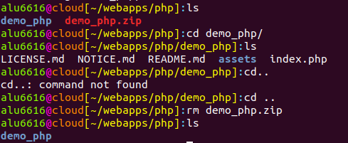

# **UT1-A4: Sirviendo aplicaciones Php y Python**
En esta actividad nos dispondremos a configurar 2 sitios web (virtual hosts) en nuestro servidor web Nginx, con las siguiguientes características.

## Sitio web 1
Queremos que la URL de este sitio web sea `http://php.aluXXXX.me` y que en esa página se muestre la aplicación [demo_php.zip](https://github.com/sdelquin/claseando/blob/master/imw/UT1/assignments/assignment4/demo_php.zip).

Para empezar, crearemos en el directorio *webapps* la carpeta **php**.


Ahora, en `/etc/nginx/sites-available` crearemos el archivo que dará lugar a nuestro sitio web usando el camando **sudo nano php.aluXXXX.me**.


Y dentro escribiremos lo siguiente:


Guardamos el archivo y nos dirigimos a la carpeta **/etc/nginx/sites-enabled** para enlazar el archivo.


Volvemos a ir a la carpeta */webapps/php* y descargamos la demo nombrada al principio de la práctica: [demo_php.zip](https://github.com/sdelquin/claseando/blob/master/imw/UT1/assignments/assignment4/demo_php.zip).


La descomprimimos con el comando **unzip**.


Comprobamos que se ha descomprimido correctamente y borramos el zip descargado utilizando **rm demo_php.zip**.



Para comprobar el resultado de este primer sitio web, debemos dirigirnos a `php.aluXXXX.me` y deberiamos ver esto:


## Sitio web 2

La URL de este segundo sitio web deberá ser `http://now.aluXXXX.me`

Al igual que al principio del siti web anterior, nos dirigiremos a la carpeta **webapps**
y dentro, crearemos otra llamada `now`.


Dentro de ella ejecutamos el comando **pipenv install**.


A continuación, instalamos los paquetes `flask` y `pytz`.


Ahora, en la misma carpeta en la que nos encontrsamos, creamos un fichero `main.py` e introducimos el siguiente código:

```bash
import datetime
import pytz
from flask import Flask
app = Flask(__name__)

@app.route('/')
def hello():
    now = datetime.datetime.now(pytz.timezone("Atlantic/Canary"))
    return '''
    <h1>Testing Python over Nginx</h1>
    <h2>In Canary Islands...</h2>
    Today is: {today}
    <br>
    Now is: {now}
    '''.format(
        today=now.strftime('%d/%m/%Y'),
        now=now.strftime('%H:%Mh')
    )
```


Para comprobar que lo hacho anteriormente funciona, ejecutaremos el siguiente comando:


Ahora vamos a la carpeta `/etc/nginx/sites-available` y creamos el fichero que dará lugar al servidor **(sudo nano now.aluXXXX.me)**.


Lo enlazamos en la carpeta `etc/nginx/sites-enavb`


