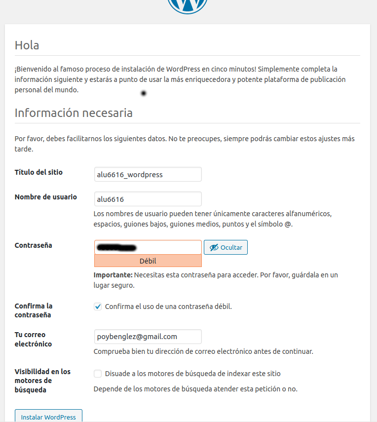

# **UT4-A1: Implantación de Wordpress**

## **Configuración de la base de datos**

Para empezar usaremos el intérprete de MySQL para acceder a una base de datos.

Creamos una base de datos, un usuario y le asignamos privilegios.

## **Descarga del código**

Descargamos el código fuente de Wordpress desde su página web.

Ahora descomprimimos el código y lo copiamos en */usr/share*

Establecemos los permisos necesarios para que el usuario web *www-data* pueda usar estos ficheros.

## **Editar ficheros de Configuración**

Para una configuración básica de WordPress debemos especificar lo siguiente:

    - El nombre de la base de datos.
    - El usuario.
    - La contraseña.

## **Acceso mediante Nginx**

Para que nuestro sitio Wordpress sea accesible desde un navegador web, debemos incluir las directivas necesarias en la configuración del servidor web Nginx.

Supongamos que queremos acceder a nuestro Wordpress desde la url wordpress.vps.claseando.es. Para ello tendremos que crear un nuevo virtual host de la siguiente manera:

Enlazamos la configuración para que el virtual host esté disponible:

Recargamos el servidor web Nginx para que los cambios sean efectivos:

## **Configuración del sitio vía web**

Cuando accedemos a http://wordpress.aluXXXX.me nos redirige a http://wordpress.aluXXXX.me/wp-admin/install.php

Elegimos Español (O el idioma deseado).

Rellenamos los campos que nos piden y pulsamos *Instalar Wordpress*.

Accedemos con uestras credenciales.

## **Ajustes de permalinks**

Nos dirigimos a Ajustes, en el panel a la izquierda, y seleccionamos *Enlaces permanentes*.

seleccionamos *Día y nombre* y guardamos los cambios.

Ahora indicamos a Nginx que enlace estas URLs:

(Solo hace falta añadir la última location que se muestra en la captura.)

Recargamos la configuración de Nginx con el comando **sudo systemctl reload nginx**

## **Límite de tamaño en la subida de archivos**

Por defecto, el tamaño límite de subida de los archivos es de 2MB, así que procedemos a cambiarlo:

Modificamos estas líneas del siguiente fichero.

A continuación reiniciamos el servicio *php-fpm*.
Además, deberemos añadir una líneaen el fichero de configuración de Nginx.

Para que los cambios se guarden, recargamos el servidor web Nginx.

## **Estructura de ficheros**

Comprobamos la estructura de ficheros.

## **Sitio web seguro**

Para hacer que este sitio web sea seguro, deberemos ejecutar *certbot* desde nuestro terminal.

Elegimos el sitio web que queremos que sea seguro y seleccionamos las otras opciones a nuestro gusto.

Comprobamos:

Una vez hecho todo esto, podemos editar nuestro WordPress.

